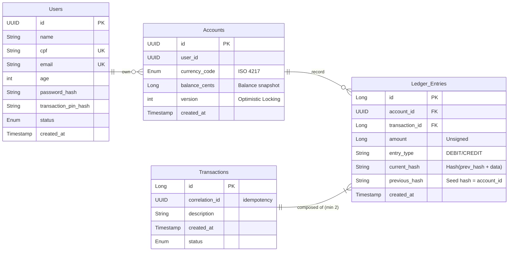

# NexusPay - Core Banking Engine

O NexusPay é uma plataforma backend para serviços financeiros construída com foco em integridade transactional, segurança multicamadas e escalabilidade modular.

O Objetivo deste projeto é demonstrar uma implementação de um sistema crítico onde a precisão de dados, integridade e segurança são os pilares fundamentais.

## Arquitetura/Design e Desenvolvimento

Essa aplicação utiliza uma abordagem de monólito modular (Spring Modulith). Cada domínio de negócio é isolado, preparando o sistema para uma futura transição para microsserviços sem a complexidade prematura de uma rede distribuída e complexa. No nível de módulos foi utilizada a arquitetura hexagonal para isolar a lógica de negócios, facilitar manutenção/escalamento e testes. Utilizando DDD para criar entidades ricas focando na lógica de negócios e TDD como fluxo de desenvolvimento com a abordagem red-green-refactor, garantindo ampla cobertura de testes, classes desacopladas e funcionais. 
##### Mais definições de modelagem do desenvolvimento da aplicação podem ser visto em no diretório [documentos](./docs/), neste constam definições de requisitos, modelagem C4, diagrama de Entidade-Relacionamento e Architectural Decision Records (ADR).

#### Módulos Principais:
- Ledger: Coração financeiro. Implementa um livro-razão imutável para garantir que nenhum dado, ou centavo, seja perdido, criado ou movido indevidamente.
- Auth: Gera a identidade dos usuários, autenticação via JWT e verificação de conta via OTP.
- Shared: Componentes transversais reutilizáveis.

####

## Decisões de arquitetura

Um padrão rígido foi seguido nas decisões de arquitetura, sendo analisados, documentados e implementados visando garantir que toda a aplicação fosse segura, precisa, íntegra além de facilitar a manutenção e escalabilidade futura, como:
- Autenticação Stateless: Implementações de Spring Security 6 com JWT, eliminando a necessidade de sessões e permitindo escalabilidade horizontal.
- Hashing de Senhas: Uso de BCrypt para proteção de credenciais, garantindo resistência a ataques de força bruta.
- Cryptographic Chaining: Entradas possuem campos hash anterior e hash atual (baseado nas informações do usuário, da transação e do hash anterior). Essa abordagem cria uma corrente que pode ser retrocedida, deixando claro alterações indevidas.
- Fluxo de Onboarding seguro: Usuários nascem com o status PENDING e só ganham acesso a operações financeiras após a validação de um OTP de 6 dígitos via canal seguro.
- Transaction PIN: Camada extra de autorização para movimentações de saldo.
- Conciliação de Dados: Para garantir a integridade do saldo, um job assíncrono feito com Spring Batch utiliza o resultado da soma entre o somatório de entradas e o de saída para verificar a exatidão do snapshot de saldo presente na entidade de contas.
- Double-Entry Bookkeeping: A aplicação não apenas altera o saldo, e sim gera duas entradas, uma de crédito e outra de débito. Esse padrão garante auditoria contábil e que toda transação tenha soma igual a zero, isso significa que nenhum valor é criado ou desaparece do nada.
- Controle de concorrência e resiliência: Afim de evitar problemas de Race Conditions e DeadLocks, utilizei a estratégia de Optimistic Locking. Um campo @Version é registrado na tabela Accounts, esse campo é checado para assegurar que uma transação ainda não foi processada, ou todo o processo sofrerá rollback. Para transações que usariam o mesmo recurso sendo processadas concomitantemente, utilizei o Spring Retry para lidar com requisições que falharam por conta de locking + uma estratégia de Exponential Backoff e Jitter.
- Observabilidade e SRE: Com o intuito de manter a aplicação sempre monitorada, utilizei o Actuator para gerar logs e métricas, Prometheus para capturar e persistir esses dados, grafana para gerar relatórios e dashboards úteis e com o micrometer tracing cada requisição pode ser visualizada, acompanhada e mensurada.

## Tech Stack

| Tecnologia | Finalidade |
| :--- | :--- |
| Spring Boot | Framework base para produtividade e robustez |
| Spring Security | Orquestração de autenticação e autorização |
| Spring Modulith | Garantia de isolamento lógico entre módulos e suporte à arquitetura modular |
| Spring Retry | Implementação de resiliência e tolerância a falhas em operações transitórias |
| PostgreSQL | Banco de dados relacional para consistência ACID |
| Hibernate/JPA | Abstração de persistência e mapeamento objeto-relacional (ORM) |
| FlyWay | Gerenciamento e versionamento automatizado de migrações do banco de dados |
| JWT | Tokens compactos e seguros para validação de identidade em arquiteturas stateless |
| TestContainers | Testes de integração fiéis à produção utilizando containers Docker efêmeros |
| Rest Assured | DSL fluida para testes automatizados de APIs REST com foco em BDD |
| Docker | Containerização para padronização de ambientes de desenvolvimento e infraestrutura |

## Como executar

Certifique-se de ter o Docker, Docker compose e Java 21 instalados.

#### Clone o repositório
    git clone https://github.com/Sesans/nexuspay.git

#### Faça o build da aplicação
    docker compose build

#### Suba a aplicação
    docker compose up -d
