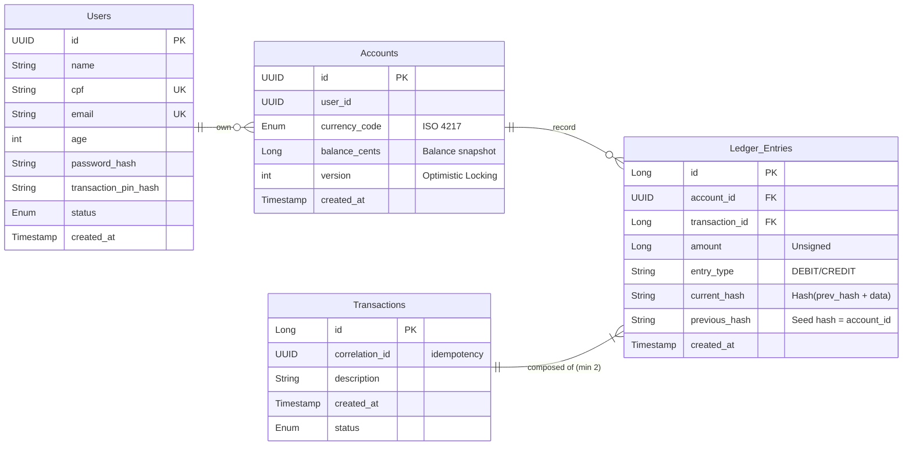

# NexusPay - Core Banking Engine

NexusPay is a backend platform for financial services built with a focus on transactional integrity, multi-layered security, and modular scalability.

The goal of this project is to demonstrate the implementation of a mission-critical system where data accuracy, integrity, and security are the cornerstones.

## Architecture/Design and Development

This application uses a modular monolith approach (Spring Modulith). Each business domain is isolated, preparing the system for a future transition to microservices without the premature complexity of a distributed and complex network. At the module level, the Clean Architecture was used to isolate business logic and facilitate maintenance, scaling, and testing. DDD was used to create rich entities focused on business logic, and TDD was employed as the development workflow using the red-green-refactor approach, ensuring comprehensive test coverage, decoupled classes, and functional design. 
##### Further application development modeling definitions can be found in the [documents](./docs) directory, which contains requirement definitions, C4 modeling, Entity-Relationship diagrams, and Architectural Decision Records (ADR).

#### Main Modules:
- Ledger: The financial backbone. Implements an immutable ledger to ensure that no data—or a single cent—is lost, created, or moved improperly.
- Auth: Manages user identities, authentication via JWT, and account verification via OTP.
- Shared: Reusable cross-functional components.

####

## Architectural decisions

A strict standard was followed in architectural decisions, which were analyzed, documented, and implemented to ensure that the entire application was secure, accurate, and reliable, while also facilitating future maintenance and scalability, such as:
- Stateless Authentication: Implementation of Spring Security 6 with JWT, eliminating the need for sessions and enabling horizontal scalability.
- Password Hash: Use of BCrypt to protect credentials, ensuring resistance to brute-force attacks.
- Cryptographic Chaining: Entries include fields for the previous hash and the current hash (based on user information, transaction details, and the previous hash). This approach creates a chain that can be traced backward, making any unauthorized changes evident.
- Secure Onboarding Flow: Users start with PENDING status and only gain access to financial transactions after validating a 6-digit OTP via a secure channel.
- Transaction PIN: An extra layer of authorization for balance transactions.
- Data Reconciliation: To ensure balance integrity, an asynchronous job using Spring Batch calculates the difference between the sum of incoming and outgoing transactions to verify the accuracy of the balance snapshot in the accounts entity.
- Double-Entry Bookkeeping: The application does not simply change the balance; instead, it generates two entries, one credit and one debit. This standard ensures accounting auditability and that every transaction has a net total of zero, meaning that no value is created or disappears out of thin air.
- Concurrency control and resilience: To avoid race conditions and deadlocks, I used the optimistic locking strategy. A @Version field is stored in the Accounts table; this field is checked to ensure that a transaction has not yet been processed, or the entire process will be rolled back. For transactions accessing the same resource that are processed concurrently, I used Spring Retry to handle requests that failed due to locking, along with an Exponential Backoff and Jitter strategy.
- Observability and SRE: To ensure the application is constantly monitored, I used Actuator to generate logs and metrics, Prometheus to capture and persist this data, Grafana to generate useful reports and dashboards, and with Micrometer tracing, each request can be visualized, tracked, and measured.

## Tech Stack

| Technology      | Purpose                                                                        |
|:----------------|:-------------------------------------------------------------------------------|
| Spring Boot     | Core framework for productivity and robustness                                 |
| Spring Security | Authentication and authorization orchestration                                 |
| Spring Modulith | Ensures logical isolation between modules and supports modular architecture    |
| Spring Retry    | Implements resilience and fault tolerance in transient operations              |
| PostgreSQL      | Relational database for ACID consistency                                       |
| Hibernate/JPA   | Persistence abstraction and object-relational mapping (ORM)                    |
| FlyWay          | Automated management and versioning of database migrations                     |
| JWT             | Compact and secure tokens for identity validation in stateless architectures   |
| TestContainers  | Production-faithful integration testing using ephemeral Docker containers      |
| Rest Assured    | Fluid DSL for automated testing of REST APIs with a focus on BDD               |
| Docker          | Containerization for standardizing development environments and infrastructure |

## API endpoints

| Endpoint                | Method | Description            |
|:------------------------|:-------|:-----------------------|
| /api/v1/auth/register   | POST   | Register a new user    |
| /api/v1/auth/verify     | POST   | Verify the user e-mail |
| /api/v1/ledger/transfer | POST   | Do a transaction       |
| /api/v1/account         | POST   | Create a new account   |

## How to run

Make sure you have Docker, Docker Compose, and Java 21 installed.

#### Clone the repository
    git clone https://github.com/Sesans/nexuspay.git

#### Build the application
    docker compose build

#### Run the application
    docker compose up -d
